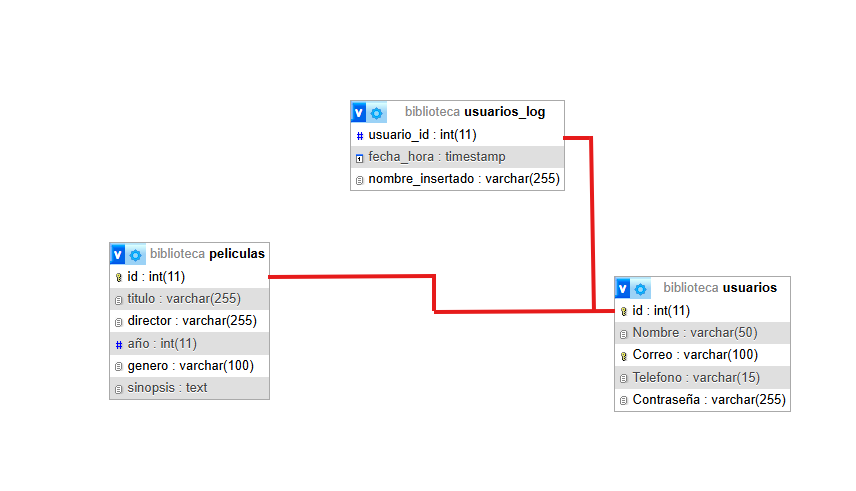

# 🎬 Aplicación de Películas – Proyecto 3º Trimestre

## 📌 Descripción

Aplicación de gestión y visualización de películas con las siguientes funcionalidades principales:

- 🔐 Registro e inicio de sesión de usuarios.
- 🎞️ Catálogo completo de películas con filtros por género y año.
- 🔎 Búsqueda personalizada de películas y visualización de detalles.
- 📥 Opción para descargar la app y ver todas las películas en 4K.

---

## ⚙️ Requisitos

Para ejecutar correctamente esta aplicación necesitas:

1. ☕ Java JDK 8  
2. 🛢️ MySQL Server  
3. 🔌 MySQL Connector (ya incluido en la carpeta `/lib`)  
4. 💻 IDE compatible (se ha utilizado Eclipse durante el desarrollo)

---

## 🗂️ Estructura de Archivos
/src
└── /Proye
├── Registrarse.java → Ventana de registro de usuario
├── Principal.java → Ventana de inicio de sesión
├── Catalogo_Completo.java → Catálogo con filtros por género y año
├── Buscar_Pelicula.java → Buscador con detalles de cada película
└── /imagenes → Carpeta con fondos y carteles (fondo3.png)
/lib
└── mysql-connector-java-X.X.XX → Conector de base de datos

---

## 🚀 Cómo Usarla y Funcionalidades

Una vez ejecutada la aplicación, podrás acceder a las siguientes funciones:

- ✅ **Registro e inicio de sesión:** protege el acceso y permite personalización.
- 🔍 **Buscador de películas:** encuentra fácilmente el título que desees.
- 🎬 **Catálogo completo:** listado de todas las películas disponibles con:
  - Imágenes promocionales (carteles)
  - Filtros por género y año
- 📥 **Botón de descarga:** instala la app para disfrutar del contenido completo en 4K.
- 📂 **Menú desplegable:** accede rápidamente a todas las películas desde un selector.

---

## 🚀 Diagrama base de datos

